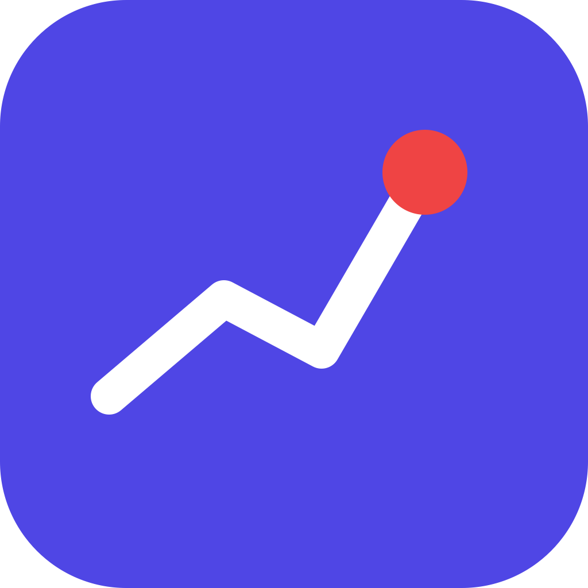
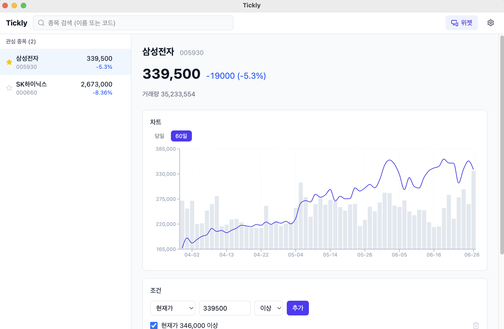
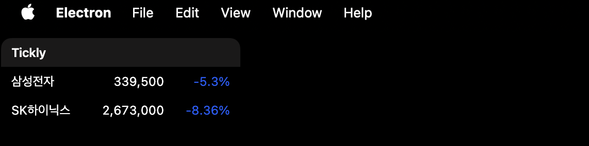

<div align="center">
  

  # Tickly

  **Your Personal Korean Stock Watcher**

  서버 없이 로컬에서 동작하는 개인용 한국 주식 실시간 모니터링 데스크톱 앱
</div>

---

## 소개

Tickly는 프로그램 하나만 실행하면 한국 주식의 **실시간 시세 조회 · 조건 검사 · 알림 · 위젯**이
모두 로컬에서 동작하는 데스크톱 애플리케이션입니다. 별도의 백엔드 서버나 클라우드가 없습니다.

시세·차트·검색 데이터는 **네이버 금융**의 공개 엔드포인트에서 가져옵니다. (가입·API Key 불필요)

## 화면

| 메인 | 위젯 |
|------|------|
|  |  |

## 주요 기능

- **관심 종목** — 전 종목 실시간 검색, 추가/삭제, 즐겨찾기 (SQLite 영속화)
- **실시간 시세** — 설정한 주기(5/10/30/60초)로 폴링, 등락률 색상 표시(상승=빨강, 하락=파랑)
- **차트** — 당일 분봉 / 최근 60일 일봉 (종가 라인 + 거래량)
- **조건 알림** — 현재가·등락률·거래량 임계값 조건, 충족 시 데스크톱 알림 + 인앱 배너 + 이력 저장 (중복방지)
- **설정** — 조회 주기, 알림 ON/OFF
- **데스크톱 위젯** — 프레임리스·투명·항상 위, 드래그 이동, 위치/크기 기억, Click-through(`Cmd+Shift+T`), 종목 클릭 시 메인 열기
- **로그** — API 호출·알림·오류를 파일로 기록 (`~/Library/Logs/tickly/main.log`)

## 기술 스택

TypeScript · Electron · React · Vite · Tailwind CSS ·
SQLite(better-sqlite3) · Recharts · Lucide · electron-log

## 설치 (macOS)

한 줄로 설치 (Apple Silicon):

```bash
curl -fsSL https://raw.githubusercontent.com/kim-taehan/tickly/main/install.sh | bash
```

`/Applications/Tickly.app` 로 설치됩니다. 미서명 앱이라 스크립트가 Gatekeeper quarantine을 제거합니다.

## 실행 방법 (개발)

```bash
pnpm install        # 의존성 설치 (better-sqlite3는 Electron ABI로 자동 리빌드)
pnpm dev            # 개발 모드 실행
```

기타 스크립트:

```bash
pnpm build          # 프로덕션 번들 빌드
pnpm typecheck      # 타입 검사
pnpm package        # 앱 패키징 (electron-builder 필요: pnpm add -D electron-builder)
```

## 프로젝트 구조

```
src/
  main/         Electron 메인 프로세스
    database/       SQLite 연결·스키마
    repositories/   watchlist · conditions · alertHistory · settings
    services/       quotes(provider) · quoteScheduler · alertService · widgetWindow · logger
    ipc/            렌더러용 IPC 핸들러
  preload/      contextBridge API (window.tickly)
  renderer/     React UI (메인 + 위젯)
  shared/       메인·렌더러 공용 타입·로직
```

## 데이터 출처 / 면책

시세·검색·차트는 네이버 금융 공개 엔드포인트를 사용합니다. 비공식 엔드포인트이므로 예고 없이
바뀔 수 있으며, **개인 학습·모니터링 용도**입니다. 투자 판단의 책임은 사용자에게 있습니다.
